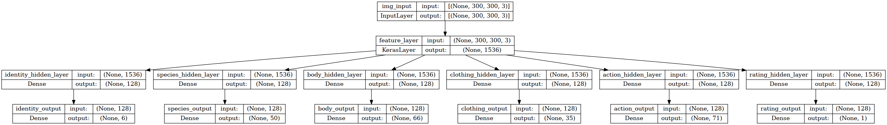

# Furry Image Model
Hey there! This is my project on labeling furry artwork!

## How To Use

1. Create a python enviornment using your favorite flavor of enviornment creation (venv, conda, etc).
2. Use `pip install -r requirements.txt` in the root directory of this project to install all dependencies required for this project.
3. Follow [the appropriate steps](https://www.tensorflow.org/install/pip) for installing GPU accelerated TensorFlow (if necessary).
4. Download a model from the Model List (below).
5. Try out the [Jupyter Notebook](./example_usage.ipynb) to see how to use this project!

## Model List

Since models are very large, you need to download them separately. Here are some links for you to do this.

**WARNING:** Accuracy for tags is misleading in this context. Recall is a better measure of performance in this context.

| Model Name                | F1-Score | Recall | Precision | Accuracy (Tags) | Accuracy (Rating) | Size         | Requires GPU | Zip File                                                                                 |
|---------------------------|----------|--------|-----------|-----------------|-------------------|--------------|--------------|------------------------------------------------------------------------------------------|
| convnext_tiny_224_5       | 0.58     | 0.46   | 0.78      | 0.95            | 0.779             | 29.1M params | ✅          | [link](https://drive.google.com/uc?export=download&id=1VIhh0yfhJuXXTFo_0XPnOeQp5ePqnjDW) |
| efficientnet_v2_b3_300_2c | 0.50     | 0.37   | 0.74      | 0.94            | 0.728             | 14.1M params | ❌          | [link](https://drive.google.com/uc?export=download&id=1n-qEMXU86G8A_UEpZ9_CmAPWdBkMO_zY) |
| mobilenet_v3_224_2c       | 0.29     | 0.18   | 0.71      | 0.94            | 0.680             |  3.1M params | ❌          | [link](https://drive.google.com/uc?export=download&id=1fh2VrLo-bKgGHIkLEQecwUltsuI0W0Tm) |

### What do the Names mean?

The format of the name is `<base_feature_model>_<img_size>_<num_epochs>`.
- `base_feature_model` - just explains the model used as the backbone. Ex: "efficientnet_v2_b3"
- `img_size` - size of the input. Ex: "300"
- `num_epochs` - number of iterations a model has gone through during training.

### What do the metrics mean?

**F1-Score** - This is a general metric of how well the model is performing in terms of recall and precision. You can equate this score to how well the model balances recall and precision.

**Recall** - This metric is telling you that given the tag actually exists in the image, will the model predict that tag is in the image.

**Precision** - This metric is telling you how often a predicted tag is a false positive. A high precision means that the model will not always just say a tag exists in images.

**Accuracy (Tags)** - This metric is telling you the number of correct true tags AND false tags in an image. You may notice that it's insanely high! That's because tagging images, by nature, is an incredibly sparse answer. Rarely does an image have EVERY possible tag. This means that you can often guess that a tag doesn't exist and have a high accuracy (think fraud detection).

**Accuracy (Rating)** - This metric is much more trustworthy compared to the previous accuracy metric. This is because the rating values are mutually exclusive from each other, unlike the multi-output tag prediction heads. You may notice that compared to my [rating only classifier](https://github.com/ZenithO-o/nsfw-furry-detector), this model's score is down 10%! Well, not quite. While it is true that the raw number is lower, this model takes into account all of my concerns in the previous project, where this model now is able to detect questionable material, and it also gives a single scalar value for it as well (for you to make your own distinctions).

## Model Architecture

This model uses multiple prediction heads in order to predict for the 6 different categories. These categories are `action`, `body`, `clothing` `identity`, `rating`, and `species`. In the `./categories/` folder, you can see a detailed description of all the tags for each category.

Here is an image showcasing the model `effnet_b3_300_2c`:

(write more here)

## Datasets

## Performance

## Other

A couple of Q&A for problems:

- Why am I getting the error `Graph execution error: Fused conv implementation does not support grouped convolutions for now.`?
  - This is because you are probably using CPU instead of GPU for executing a ConvNext model.

### Todo

- Finish README
- Add more usable models
- Develop a testing procedure to evaluate how a model performs on furry artwork.
